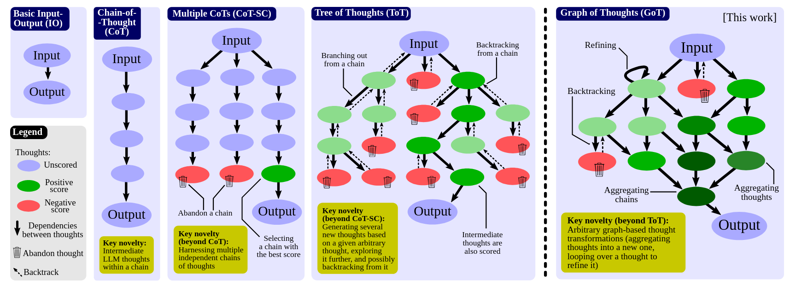

# Graph of Thoughts (GoT)

  

This is the implementation of my master thesis. This framework gives you the ability to solve complex problems by modeling them as a Graph of Operations (GoO), which is automatically executed with a Large Language Model (LLM) as the engine. This framework is designed to be flexible and extensible, allowing you to not only solve problems using the new GoT approach, but also to implement GoOs resembling previous approaches like CoT or ToT.
